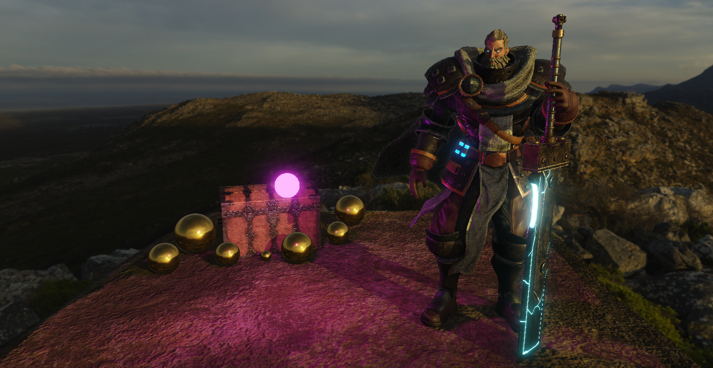

# OpenGL 3D Scene

## Description

A 3D scene made with the 300 es version of the OpenGL API as part of a noted project at the Sae Institute Geneva.

### Features

- OBJ Model Loading
- Instancing
- Face and Frustum Culling
- Cubemap
- Deferred Shading
- Screen Space Ambient Occlusion (SSAO)
- Shadow Mapping
    - Directional Light Shadow Map
    - Point Light Shadow Cubemap
- Physically Based Rendering (PBR)
    - Image Based Lighting (IBL)
    - Directional Light
    - Point Light
- Emissive Textures Mapping
- Physically Based Bloom
- High Dynamic Range (HDR) + Tone Mapping + Gamma Correction

## Blog posts
- [How I created an OpenGL 3D scene.](https://chocolive24.github.io/3d_scene/3d_scene.md.html)
